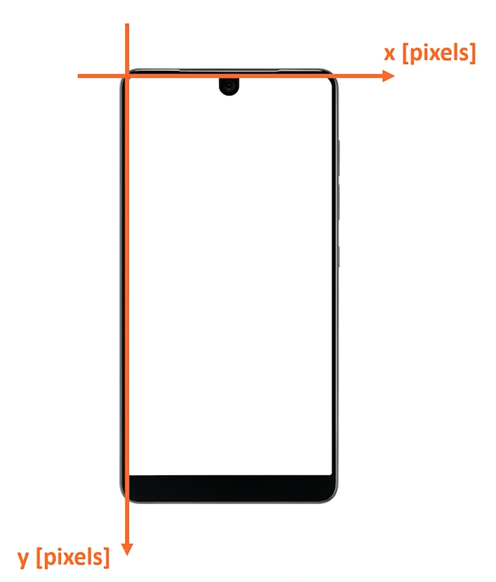
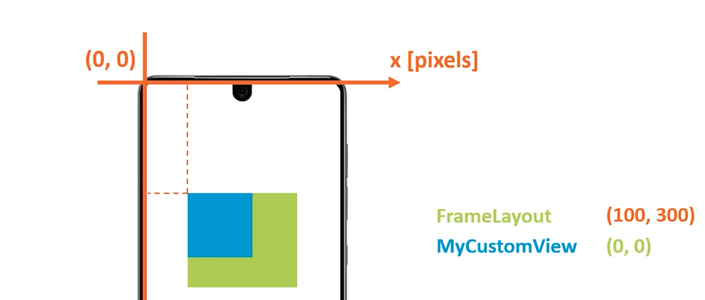
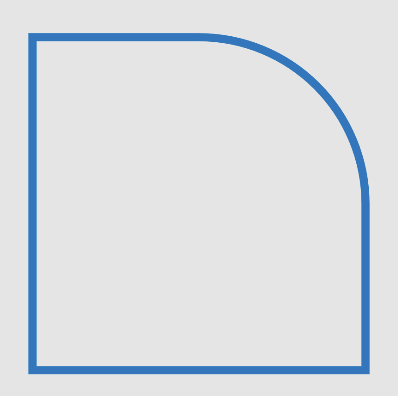

# Android Custom Views Course

This repo contains the source code of the tutorial application for [Android Custom Views Course](https://www.techyourchance.com/courses/android-custom-views/).

## 1. Basics

### 1.1 Creating a Custom View
When creating a custom View you need to extend the class `View`.
Then you implement the default constructors.

There are two important functions you have to override.
1. `onSizeChanged(w, h, oldW, oldH)` - will be called when this view changes its size. This is the place to init all values that depend on the size of the view.
2. `onDraw(c)` - will be called when this view needs to redraw itself.

### 1.2 Coordinate System
The coordinate system origin `(0,0)` is located at the top-left of the screen.


Nested views x and y coordinates are measured relative to its parent's origin.


### 1.3 Density Independent Pixel
A size of a pixel varies between different screens.
In some cases, UI element should have specific physical size, regardless of screen's characteristics.
- `1dp = ~0.16 mm`

### 1.4 Best Practices
`onDraw` should not contain any computational intense logic. `onDraw` should return as quickly as possible. Instead move any computations into `onSizeChanged`.

General util function to convert dp into px:
```kotlin
fun dpToPx(dp: Float): Float {
	return TypedValue.applyDimension(
        TypedValue.COMPLEX_UNIT_DIP,
        dp,
        context.resources.displayMetrics
	)
}
```

### 1.5 Basic Shape: Line
To draw anything we need an instance of `Paint`.
```kotlin
class CustomLine : View {
	// omitting default constructors

	private val paint = Paint()
    
    private var lineXLeft = 0f
	private var lineXRight = 0f
	private var lineYPos = 0f
	private var lineHeight = 0f
    
    fun onSizeChanged(w: Int, h: Int, oldW: Int, oldH: Int) {
		super.onSizeChanged(w, h, oldW, oldH)
        val lineMarginHorizontal = dpToPx(LINE_MARGIN_HORIZONTAL_DP)
        lineXLeft = lineMarginHorizontal
        lineXRight = w - lineMarginHorizontal
        lineYPos = h * LINE_VERTICAL_POS_FRACTION
		lineHeight = dpToPx(LINE_HEIGHT_DP)
	}

	override fun onDraw(canvas: Canvas) {
		paint.color = Color.Red
		paint.style = Paint.Style.STROKE
		paint.strokeWidth = dpToPx(LINE_HEIGHT_DP)
		canvas.drawLine(
            startX = lineXLeft, 
            startY = lineYPos, 
            stopX = lineXRight,
			stopY = lineYPos, 
            paint
		)
	}
    
    companion object {
		const val LINE_HEIGHT_DP = 2f
        const val LINE_MARGIN_HORIZONTAL_DP = 20f
        const val LINE_VERTICAL_POS_FRACTION = 0.3f
	}
}
```

### 1.6 Basic Shape: Rectangle
```kotlin
class CustomLine : View {
	// omitting default constructors

	private val paint = Paint()
    private val rectangle = RectF()
    
    fun onSizeChanged(w: Int, h: Int, oldW: Int, oldH: Int) {
		super.onSizeChanged(w, h, oldW, oldH)
		val rectangleMarginHorizontal = dpToPx(RECT_MARGIN_HORIZONTAL_DP)
        val rectangleWidth = w - 2 * rectangleMarginHorizontal
        val rectangleHeight = rectangleWidth / 2
        rectangle.set(
			left = rectangleMarginHorizontal,
			top = (h - rectangleHeight) / 2,
			right = rectangleMarginHorizontal + rectangleWidth,
			bottom = (h + rectangleHeight) / 2
		)
	}

	override fun onDraw(canvas: Canvas) {
		paint.color = Color.Red
		paint.style = Paint.Style.STROKE // or FILL to fill the rect
		paint.strokeWidth = dpToPx(LINE_HEIGHT_DP)
		canvas.drawRect(rectangle, paint)
	}
    
    companion object {
		const val LINE_HEIGHT_DP = 2f
        const val RECT_MARGIN_HORIZONTAL_DP = 20f
	}
}
```

### 1.7 Basic Shape: Circle
```kotlin
class CustomLine : View {
	// omitting default constructors

	private val paint = Paint()
    private var circleXCenter = 0f
    private var circleYCenter = 0f
    private var circleRadius = 0f
    
    fun onSizeChanged(w: Int, h: Int, oldW: Int, oldH: Int) {
		super.onSizeChanged(w, h, oldW, oldH)
		circleXCenter = w / 2f
        circleYCenter = h * CIRCLE_HEIGHT_POS_FRACTION
        circleRadius = h * CIRCLE_RADIUS_FRACTION
        
	}

	override fun onDraw(canvas: Canvas) {
		paint.color = Color.Red
		paint.style = Paint.Style.STROKE // or FILL to fill the rect
		paint.strokeWidth = dpToPx(LINE_HEIGHT_DP)
		canvas.drawCircle(
            cx = circleXCenter, 
            cy = circleYCenter, 
            radius = circleRadius, 
            paint
		)
	}
    
    companion object {
		const val LINE_HEIGHT_DP = 2f
        const val CIRCLE_HEIGHT_POS_FRACTION = 0.8f
        const val CIRCLE_RADIUS_FRACTION = 0.1f
	}
}
```

### 1.8 Touch Events
Handling touch events in a custom view just override `onTouchEvent(event: MotionEvent?): Boolean`.

### 1.9 View State Preservation on Config Change (and Process Death)
When the system determines that the view must save its state it calls `onSaveInstanceState()`.

Similarly to restore a view state you need to override `onRestoreInstanceState()`.

To save the state of the view you create a new State class that extends `View.BaseSavedState`.

To allow the system calling the functions above, you __must ensure__ that your created view as some unique id.
```kotlin
override fun onCreateView(...): View {
	return MyView(context).apply { id = R.id.my_view }
}
```

## 2. Animations
Animations are a gradually change of UI properties over time.
You can either animate the entire view (from external) -> see `ObjectAnimator`.
Or you can animate the view from inside, if you have control over the source code -> see `ValueAnimator`.

### 2.1 ObjectAnimator (external)
Use the `ObjectAnimator` to animate views. There are several functions to initialize it. 
One is `ofFloat` and it expects several arguments:
- `target`: the target view to be animated
- `propertName`: the name of the property (Float) as a String (it used reflection under to hood)
- `vararg values`: range of values the animation should apply

Once you have an instance of `ObjectAnimator` you can call `start()` and `cancel()`.

The __ObjectAnimator__ is useful when you do not have control over the view you want to animate.
However, if you own the view you wanna animate you should consider `ValueAnimator` instead.
Actually `ObjectAnimator` extends `ValueAnimator`.

#### 2.1.1 Loop
By default `ObjectAnimator` will animate only once without any loop.
To keep the animation running you can set the `repeatCount = ValueAnimator.INFINITE`.

#### 2.1.2 Repeat Mode
To change the repeat mode, like to reverse the animation you can set the `repeatMode = ValueAnimator.REVERSE`.

#### 2.1.3 Duration
To adjust the duration of the animation (eg slow it down) you can set the `duration = 100`(ms).

#### 2.1.4 Interpolation
The interpolation specifies if the movement is linear or not. To get a linear interpolation you can set `interpolator = LinearInterpolator()`.

### 2.2 ValueAnimator (internal)
```kotlin
fun startAnimation(period: Long) {
	valueAnimator = ValueAnimator.ofFloat(0, 1f).apply {
		interpolator = LinearInterpolator() // or AccelerateInterpolator()
        duration = period / 2 // because we are reversing the animation, so it will be half the period
        repeatCount = ValueAnimater.INFINITE
        repeatMode = Valueanimator.REVERSE
        val relativePosition = 0f // needs to properly calculated and set
        setCurrentFraction(relativePosition)
        addUpdateListener {
			// gets the value of the ValueAnimator
			val fraction = it.animatedValue as Float // will be in range 0..1
		    // update the state of the view according to the current animated fraction and then invalidate
            invalidate()
        }
        start()
    }
}
```

### 2.3 Path
Allows to draw custom shapes.
During `onSizeChanged()` you define the path of the shape. This is defining a triangle shape.
```kotlin
path.reset()
path.moveTo(x, y)
path.lineTo(right.x, right.y)
path.lineTo(left.x, left.y)
path.lineTo(top.x, top.y)
path.close()
```

To finally draw the shape you call `canvas.drawPath(path, paint)` within `onDraw()`. 

#### 2.3.1 Path Animation
You can animate along a (already set) path using `PathMeasure` along with `ValueAnimator`:
```kotlin
fun updatePath(fraction: Float) {
	val pathMeasure = PathMeasure(referencePath, false)
	val totalPathLength = 42
	path.reset()
	pathMeasure.getSegment(0f, fraction * totalPathLength, referencePath, true)
    invalidate()
}

fun animatePath() {
	valueAnimator = ValueAnimator.ofFloat(0f, 1f).apply {
		// ...
		addUpdateListener { updatePath(it.animatedValue as Float) }
    }
    valueAnimator.start()
}
```

### 2.4 AnimatorSet
Instead creating several `ValueAnimator`'s you can stack multiple animations using `AnimatorSet`. You can reference different `ValueAnimator` instances within an `AnimatorSet`:
```kotlin
val animatorSet = AnimatorSet().apply {
	play(firstValueAnimator).before(secondValueAnimator)
    start()
}
```

## 3. Text
When working with text you should enable AntiAlias on the `Paint`:
```kotlin
val paint = Paint(Paint.ANTI_ALIAS_FLAG)
paint.color = Color.BLUE
paint.textalign = Paint.Align.CENTER // text will be aligned to the baseline that is basically set using this
textPaint.typeface = ResourceCompat.getFont(context, R.font.your_custom_font)
```

## 4. Rect Path
A rectangle can be drawn by defining a rect path.
```kotlin
val rectSize = min(w, h) / 2f
val rect = RectF(
    (width - rectSize) / 2,
    (height - rectSize) / 2,
    width.toFloat() - (width - rectSize) / 2,
    (height + rectSize) / 2
)

rectPath.reset()
rectPath.addRect(rect, Path.Direction.CW)
```

You can also adjust each corner like:
```kotlin
 rectPath.addRoundRect(
    rect, 
    floatArrayOf(
        // the order depends on Path.Direction.CW (clock-wise) or Path.Direction.CCW (counter-clock-wise)
        0f, 0f, // top-left
        rectSize / 2, rectSize / 2, // makes the top-right corner round, rectSize / 2 == radius
        0f, 0f, // bottom-right
        0f, 0f,  // bottom-left
	 ),
    Path.Direction.CW)
```


## 5. Self Measurement
Informing the view system about the desired size of the custom view. To do this you can override `onMeasure()`. This function receives two `MeasureSpec` for the width and the height. From this spec you can get the __mode__ and the desired width and height.

__In general if you are overriding `onMeasure` you would not implement `onSizeChanged`!__

In case your custom view size changes you need to inform the system to call `onMeasure` again.
You can do this by calling `requestLayout()`.

```kotlin
override fun onMeasure(widthMeasureSpec: Int, heightMeasureSpec: Int) {
	val selfWidth = dpToPx(SELF_WIDTH_DP).toInt()
	val selfHeight = dpToPx(SELF_HEIGHT_DP).toInt()

	val desiredWidth = MeasureSpec.getSize(widthMeasureSpec)
	val width = when(MeasureSpec.getMode(widthMeasureSpec)) {
		MeasureSpec.EXACTLY -> desiredWidth // respect the size the parent requests 
		MeasureSpec.AT_MOST -> min(desiredWidth, selfWidth)
		else -> selfWidth
	}

	val desiredHeight = MeasureSpec.getSize(heightMeasureSpec)
	val height = when(MeasureSpec.getMode(heightMeasureSpec)) {
		MeasureSpec.EXACTLY -> desiredHeight
		MeasureSpec.AT_MOST -> min(desiredHeight, selfHeight)
		else -> selfHeight
	}

	setMeasuredDimension(width, height) // must call this function!
}
```